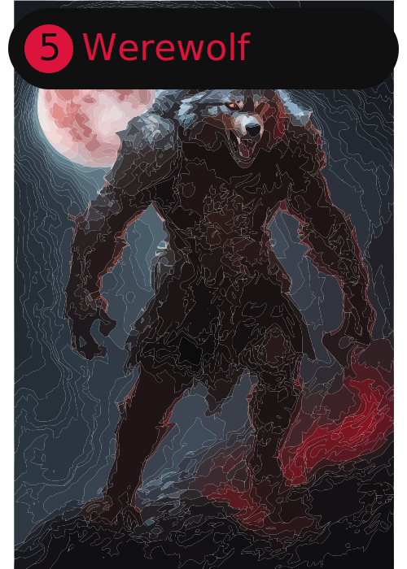

# werewolf-cards

Creats cards for the game "Werewolf".

<p>


</p>

## Usage

You can use it with python or ruby.

```bash
python main.py "NAME" "COLOR" "POWER"
```

```bash
ruby main.rb --name "NAME" --color "COLOR" --power "POWER"
```